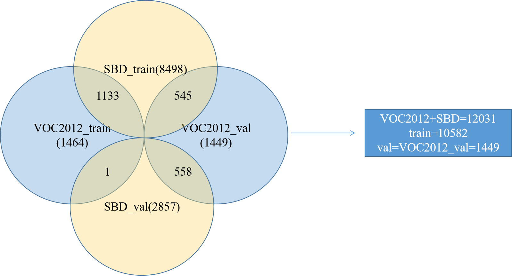

# Scribble Hides Class: Promoting Scribble-based Weakly Supervised Semantic Segmentation with Its Class Label

This repository contains training and evaluation codes, and some exmaple images of the dataset.  The pretrained checkpoint using ```resnet50+deeplabV2``` is avaliable, which is the used in our ablation study. The complete dataset with distance maps and pseudo-label will be avaliable upon paper acceptance.

## Environment setup

- anaconda3
    - python>=3.8
    - ipykernel
    - pytorch = 1.13
    - numpy
    - matplotlib
    - torchnet

It is recommanded to in install a anaconda3 for convient environment setup. Run the conda command:  
```sh
conda env create -f cdsp.yaml
```

## Scripts
The training and evaluating scripts are in ```scripts/*.sh```

## Dataset preparation
The complete ScribbleSup dataset can be downloaded [google drive](https://drive.google.com/file/d/1P_N_2RiJ0kYsz2A8-B5v3ltAxiXAmDGV/view?usp=sharing). I recollected the ScribbleSup data in 2023 for scribble-supervised semantic segmentation. It is a combination of VOC2012 and SBD, where the relationship may looks like:


### ScribbleSup dataset Structure
The original scribble annotations were recorded as a serises of points, where you can find them in ../scribble_annotation/pascal_2012/*.xml. I convert them into the png files with this [code](https://github.com/meng-tang/rloss/blob/master/data/pascal_scribble/convertscribbles.m) by matlab. 
The data structure:
``` bash
VOCdevkit/
└── VOC2012
    ├── ImageSets
    ├── pascal_2012_scribble ( I converted scribble points as pngs)
    ├── JPEGImages
    └── SegmentationClassAug 
```

## Pseudo label and distance map
Download the pseudo label generated by BMP, AFA, and SEAM [google drive]([https://drive.google.com/file/d/1P1o-fG-7kDi0DNY1TpgDSzgd1tOamOb-/view?usp=sharing](https://drive.google.com/drive/folders/1HrdPsI0K0udiPBy2_2y-j51oy205hBHH?usp=sharing)).
Download the distance map of scribble and pseudo label [google drive](https://drive.google.com/file/d/1shuSMC5XvZPvM8j9cKunBR83EOGFNOjV/view?usp=sharing)
After downloading them,  place them under the VOC2012 folder.
## (Optional) Make the distance map
The codes for making the distance map is in this [repo](https://github.com/Zxl19990529/Distance-Map)

### Train

Run the example script:  
```sh
sh scripts/train_r50_deeplabv2.sh
```  
The distance maps and pseudo-label will be avaliable soon.
### Eval
Download the pretrained checkpoint from [dropbox](https://www.dropbox.com/scl/fi/4eki9ioib3pj4g60hu6hq/train_deeplabv2_r50.zip?rlkey=qtep6d4r9ctoawxnqk0w0porw&dl=0) or [googledrive](https://drive.google.com/file/d/1EBHTmvRaYkCJKcmN26HgiBzJ6LJFZLay/view?usp=sharing), and move the checkpoint to the ```log```  folder,
Run the example script:  
```sh
sh scripts/emlc_r50_deeplabv2.sh
```  
The visualization reults will be saved in emlc_r50_deeplabv2, and the quantity results will be saved in the ```.txt``` file.
### Demo
Open the ```demo.ipynb``` with jupyter notebook, and follow the commands.

### Thanks
This repo is inspired by [URSS](https://github.com/panzhiyi/URSS)
